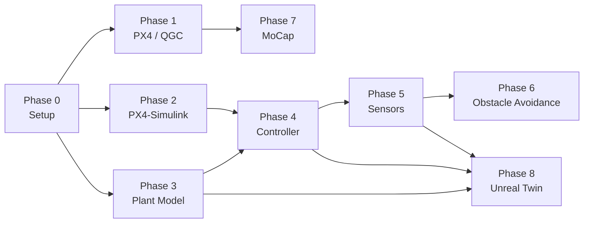

# QAV250 Indoor Drone Navigation — Implementation Plan

## Overview

This plan lays out a phased approach for the capstone project. The project is **Simulink-centered** — every major subsystem (plant model, controller, sensors, obstacle avoidance pipeline) is developed/validated in Simulink first, then progressively moved toward hardware via SIH → HITL → real flight. Unreal Engine provides the digital-twin visualization layer that plugs into the same Simulink pipeline.

> [!IMPORTANT]
> **Key Architectural Principle** — One Simulink model graph, multiple execution targets:
> - **Desktop SITL/SIH** (PX4 Host Target on PC) for rapid iteration
> - **Unreal co-sim** for photorealistic sensor testing & digital twin
> - **HITL** (Speedgoat or direct Pixhawk) for real-time validation
> - **Hardware deploy** (code-gen to Pixhawk 6C mini) for flight

---

## Hardware Bill of Materials (from project inventory)

| Component | Details | Qty |
|---|---|---|
| Flight controller | Pixhawk 6C mini | 12 |
| Motors | 2207 KV1950 | 48 |
| Props | 5″ plastic | 96 |
| GPS | M10 | 12 |
| ESC / PDB | BLHeli_S 20 A | 12 |
| Power module | PM06 v2 | 12 |
| Telemetry | 915 MHz radio | 12 |
| FPV Tx + Camera | 5.8 G VTx, Foxeer Predator 5 Micro | 12 |
| Optical flow | PMW3901 | 12 |
| LiDAR | ST VL53L1X | 12 |

---

## Phase 0 — Project Structure & Tooling

### Goal
Establish a consistent folder layout and pin all software versions.

### Proposed Folder Structure

```
Drone Project/
├── docs/                         # problem statement, datasheets, notes
├── simulink/
│   ├── plant_model/              # Phase 3 – drone dynamics
│   ├── controller/               # Phase 4 – custom flight controller
│   ├── sensors/                  # Phase 5 – sensor models & validation
│   ├── px4_integration/          # Phase 2 – host target / SIH helpers
│   ├── obstacle_avoidance/       # Phase 6 – companion-side algorithms
│   └── params/                   # MATLAB scripts defining QAV250 params
├── unreal/
│   └── IndoorDroneSim/           # Phase 8 – UE project
├── companion/                    # Phase 6 – Raspberry Pi / ESP32 code
├── mocap/                        # Phase 7 – MoCap config & bridge scripts
└── README.md
```

### Software Requirements

| Tool | Version | Notes |
|---|---|---|
| MATLAB / Simulink | **R2025b** | ✅ Confirmed — PX4 v1.14 SIH-as-SITL supported |
| UAV Toolbox | latest (R2025b) | Plant model blocks, co-sim with Unreal |
| UAV Toolbox Support Package for PX4 | latest (R2025b) | Host target, code gen, MAVLink blocks |
| Simulink Control Design | latest (R2025b) | Closed-Loop PID Autotuner, Gain-Scheduled PID Autotuner |
| Aerospace Blockset | latest (R2025b) | 6-DOF EoM, coordinate transforms |
| Simulink Coder + Embedded Coder | latest (R2025b) | C/C++ code generation for Pixhawk |
| Unreal Engine | **5.7** | ✅ Confirmed — verify UAV Toolbox Sim 3D block compat |
| PX4 firmware | v1.14.x | SIH-as-SITL support |
| QGroundControl | latest stable | Parameter tuning, mission planning |
| Companion computer | **Raspberry Pi 5** (planned) | Obstacle avoidance, MAVLink bridge |

---

## Phase 1 — PX4 / QGC Baseline (Objective 1)

### What happens
Pure hardware work — no Simulink yet. Flash, configure, and fly the QAV250 in a safe indoor setting.

### Steps
1. Flash PX4 v1.14.x via QGC onto Pixhawk 6C mini.
2. Select the **Generic Quadcopter (QAV250-style)** airframe; set motor mapping for the exact wiring.
3. Calibrate accelerometer, gyro, magnetometer, radio.
4. Configure flight modes on RC switch: **Stabilized → Altitude → Position**.
5. Mount optical flow (PMW3901) and LiDAR (VL53L1X); enable `EKF2_AID_MASK` bits for optical flow + range finder.
6. Initial PID tuning in-flight (or via QGC auto-tune wizard).
7. Document flight-test results: hover stability, position hold RMS error with MoCap ground truth (Phase 7 may feed back here).

### Deliverables
- Tuned parameter file (`.params` export from QGC)
- Short flight-test log & analysis

---

## Phase 2 — PX4–Simulink Integration (Objective 2)

### What happens
Set up the **PX4 Host Target** on the PC so Simulink can run PX4 firmware locally (SIH mode), enabling rapid controller iteration without hardware.

### Steps
1. Install **UAV Toolbox Support Package for PX4 Autopilots** via MATLAB Add-On Explorer.
2. Follow MathWorks "PX4 Host Target" setup guide:
   - Clone PX4-Autopilot source, build host target executable.
   - Configure Simulink to launch PX4 host target + connect jMAVSim (or Simulink viewer).
3. Open and run the MathWorks **PX4 Host Target SIH example model** — verify:
   - Vehicle responds to RC inputs in jMAVSim.
   - Simulink scopes show attitude, position.
4. Replace jMAVSim visualizer with Simulink 3-D viewer (precursor to Phase 8 Unreal swap).
5. Verify serial/UDP link to physical Pixhawk for future HITL.

### Key Files
- `simulink/px4_integration/px4_host_target_setup.slx`
- `simulink/px4_integration/px4_build_config.m`

---

## Phase 3 — Simulink Plant Model (Objective 3)

### What happens
Build a **modular, parameterizable** quadrotor plant model from scratch in Simulink that can slot into SIH, HITL, or Unreal co-sim.

### Architecture
```
Motor Commands [4x1]
    │
    ▼
┌────────────────────────────────┐
│  Motor / Propeller Subsystem   │  thrust & torque from RPM
│  (first-order motor dynamics,  │
│   thrust = kT·ω², torque =     │
│   kQ·ω²)                       │
└──────────┬─────────────────────┘
           │ Forces [3x1], Moments [3x1]
           ▼
┌────────────────────────────────┐
│  6-DOF Rigid Body Dynamics     │  Newton-Euler using
│  (Aerospace Blockset or custom)│  Quaternion rotation
└──────────┬─────────────────────┘
           │ States: pos, vel, quat, ω
           ▼
┌────────────────────────────────┐
│  Sensor Models Subsystem       │  IMU (accel + gyro + noise),
│                                │  baro, magnetometer, GPS,
│                                │  optical flow, LiDAR
└────────────────────────────────┘
```

### Design Decisions

- **Parameterization**: All physical constants (mass, inertia tensor `J`, arm length `L`, kT, kQ, drag coeff) live in a single MATLAB script `simulink/params/qav250_params.m`. Swapping frame = swapping param file.
- **Motor model**: First-order lag (time constant ~20–40 ms for BLHeli_S ESC) + saturation. Thrust coefficient kT and torque coefficient kQ estimated from 2207/KV1950 motor data or bench test.
- **6-DOF block**: Use Aerospace Blockset `6DOF (Quaternion)` for singularity-free rotation, or hand-build Newton-Euler equations for educational value — provide both as switchable variants.
- **Sensor noise**: Gaussian + bias models; parameters taken from Pixhawk 6C mini IMU datasheet (ICM-42688-P).

### Validation
Compare step responses and hover trim against PX4's built-in SIH model (which uses the same Newton-Euler approach) — differences should be < 5 %.

### Key Files
- `simulink/plant_model/qav250_plant.slx`
- `simulink/plant_model/motor_propeller.slx` (library subsystem)
- `simulink/plant_model/sensor_models.slx` (library subsystem)
- `simulink/params/qav250_params.m`

---

## Phase 4 — Custom Flight Controller (Objective 4)

### What happens
Build a modular cascaded PID controller, then add **PID auto-tuning** and **gain scheduling**.

### Controller Architecture
```
Position Setpoint
    │
    ▼
┌──────────────┐     ┌──────────────┐     ┌──────────────┐
│  Position PID │ ──▶ │  Attitude PID│ ──▶ │  Rate PID    │ ──▶ Motor mixer
│  (x,y,z)     │     │  (φ,θ,ψ)    │     │  (p,q,r)     │
└──────────────┘     └──────────────┘     └──────────────┘
```

### Auto-Tuning Workflow
1. Add **Closed-Loop PID Autotuner** block to each PID loop (8 loops total: 3 pos + 3 att + 3 rate – pitch/roll symmetric = 8 unique).
2. Run autotuner in SITL against the Phase 3 plant model.
3. Compare tuned gains vs PX4 defaults.

### Gain Scheduling
1. Add **Gain-Scheduled PID Autotuner** block.
2. Schedule on battery voltage (thrust decreases as voltage drops) and payload mass.
3. Validate in SITL with varying parameters.

### Benchmark
Side-by-side step-response comparison (rise time, overshoot, settling time) between custom controller and PX4 default controller running in SIH.

### Key Files
- `simulink/controller/flight_controller.slx`
- `simulink/controller/pid_autotuner_harness.slx`
- `simulink/controller/gain_schedule_config.m`

---

## Phase 5 — Sensor Integration & Validation (Objective 5)

### What happens
Bring real PMW3901, VL53L1X, and camera data into the Simulink pipeline; validate against MoCap ground truth.

### Steps
1. **PMW3901 optical flow**: Read via PX4 uORB `optical_flow` topic. In Simulink, use the PX4 uORB Read block or a custom S-Function wrapping the PX4 driver.
2. **VL53L1X LiDAR**: Read via PX4 `distance_sensor` uORB topic.
3. **Camera pipeline**: For basic use, stream via MAVLink `VIDEO_STREAM_INFORMATION`. For perception tasks (obstacle avoidance), pipe frames to companion computer (Phase 6).
4. **Validation harness**: Log sensor outputs alongside MoCap ground truth; compute RMSE for position, velocity, and altitude.
5. **EKF integration**: Either feed sensors into PX4's EKF2 (preferred for hardware simplicity) or build a custom complementary/Kalman filter in Simulink for educational purposes.

### Key Files
- `simulink/sensors/sensor_validation_harness.slx`
- `simulink/sensors/optical_flow_interface.slx`
- `simulink/sensors/lidar_interface.slx`

---

## Phase 6 — Companion Computer & Obstacle Avoidance (Objective 6)

### What happens
A Raspberry Pi (or ESP32 for lighter tasks) runs obstacle avoidance logic and sends corrected setpoints to PX4 via MAVLink.

### Architecture
```
  PMW3901 / VL53L1X / Camera
          │
          ▼
  ┌────────────────────┐       MAVLink (serial)
  │   Raspberry Pi     │ ◄──────────────────────► PX4 (Pixhawk 6C)
  │  • sensor ingest   │
  │  • obstacle map    │
  │  • path re-plan    │
  │  • setpoint stream │
  └────────────────────┘
```

### Options
| Approach | Tool | Pro | Con |
|---|---|---|---|
| ROS 2 + PX4 avoidance pkg | GitHub `PX4/avoidance` | Mature, well-documented | Heavier, requires ROS 2 on RPi |
| Simulink code-gen to RPi | Embedded Coder + RPi support | Model-based, same workflow | Higher MATLAB license cost |
| MAVSDK + custom Python | MAVSDK-Python | Lightweight | Manual integration |

> [!NOTE]
> Recommend starting with **MAVSDK-Python** for quick prototyping, then optionally convert the algorithm to a Simulink model and code-gen.

### Steps
1. Enable `COM_OBS_AVOID` on PX4.
2. Implement simple reactive avoidance (VFH or potential-field) using VL53L1X range data.
3. Bridge via MAVLink `SET_POSITION_TARGET_LOCAL_NED` messages.
4. Test in SITL first (simulated range sensor), then real RPi.

### Key Files
- `companion/obstacle_avoidance.py`
- `companion/mavlink_bridge.py`
- `simulink/obstacle_avoidance/avoidance_model.slx` (optional Simulink version)

---

## Phase 7 — Motion Capture Integration (Objective 7)

### What happens
Feed MoCap position/attitude into PX4 so the drone has cm-level indoor localization.

### Steps
1. Configure MoCap system to stream rigid-body pose.
2. Bridge to PX4 via MAVLink `VISION_POSITION_ESTIMATE` or `ATT_POS_MOCAP` (use ROS 2 MAVROS bridge or a lightweight Python script with Pymavlink).
3. Set PX4 EKF2 parameters:
   - `EKF2_AID_MASK` → enable vision position fusion
   - `EKF2_HGT_MODE` → vision
   - `EKF2_EV_DELAY` → calibrate to MoCap system latency
4. Validate: compare EKF2 fused position vs raw MoCap — should converge within a few cm.

### Key Files
- `mocap/mocap_to_mavlink.py`
- `mocap/ekf2_mocap_params.params`

---

## Phase 8 — Unreal Engine Digital Twin (Objective 8)

### What happens
Build an indoor environment in Unreal Engine and co-simulate with the same Simulink controller pipeline via the UAV Toolbox **Simulation 3D** blocks.

### Architecture
```
┌──────────────────────────────────────────────────┐
│                    Simulink                       │
│  ┌───────────┐    ┌────────────┐   ┌──────────┐ │
│  │ Controller│───▶│ Plant Model│──▶│ Sim 3D   │ │
│  │ (Phase 4) │◄───│ (Phase 3)  │   │ Vehicle  │ │
│  └───────────┘    └────────────┘   │ Block    │ │
│                                     └────┬─────┘ │
└──────────────────────────────────────────│────────┘
                                           │  lock-step
                                           ▼  co-sim
┌──────────────────────────────────────────────────┐
│               Unreal Engine                       │
│  ┌───────────────────────────────────────┐       │
│  │  Indoor Lab Environment               │       │
│  │  • walls, obstacles, furniture        │       │
│  │  • virtual camera → image stream      │       │
│  │  • virtual LiDAR → point cloud        │       │
│  └───────────────────────────────────────┘       │
└──────────────────────────────────────────────────┘
```

### Steps
1. **Unreal project**: Create `IndoorDroneSim` project. Model a room matching the physical lab (dimensions, obstacle layout).
2. **Simulink scene config**: Add `Simulation 3D Scene Configuration` block → point to UE executable or live editor.
3. **Vehicle block**: Add `Simulation 3D UAV Vehicle` block; feed pose from plant model output.
4. **Virtual sensors**:
   - `Simulation 3D Camera` → feeds images back into Simulink.
   - `Simulation 3D Lidar` → feeds point cloud.
5. **Close the loop**: Verify that the same controller + plant model that passes SITL also works in Unreal co-sim.
6. **Digital twin demo**: Real drone flies in the lab while the Unreal twin mirrors its pose (streamed via MAVLink or MoCap).

### Unreal Engine Version Compatibility

> [!WARNING]
> Check the UAV Toolbox release notes for your MATLAB version to confirm the supported UE version. R2024a/R2025a typically support UE 4.27 or early UE 5.x.

### Key Files
- `unreal/IndoorDroneSim/` (UE project)
- `simulink/plant_model/qav250_plant_unreal.slx` (variant with Sim 3D blocks wired in)

---

## Dependency Graph (Phase Ordering)



> **Phases 1, 2, and 3 can start in parallel** once Phase 0 is done.
> Phase 4 requires 2 + 3. Phase 5 requires 4.
> Phase 8 can begin environment creation alongside Phase 3 but full integration needs Phase 4 + 5.

---

## Verification Plan

Since this project is primarily Simulink-based and involves hardware-in-the-loop testing, verification spans simulation, code generation, and physical flight. Below is how each phase is verified.

### Phase 1 — PX4 / QGC Baseline
- **Manual flight test**: Hover in position-hold mode for 60 s; record PX4 `.ulg` log. Analyze with [Flight Review](https://review.px4.io/) for vibration levels, attitude tracking, position error.
- **Pass criteria**: Position hold RMS < 0.3 m (without MoCap), attitude oscillations < ±2°.

### Phase 2 — PX4–Simulink Integration
- **SIH smoke test**: Launch PX4 Host Target from Simulink, arm vehicle in jMAVSim, send position setpoint via QGC. Verify smooth response in Simulink scopes.
- **Pass criteria**: Vehicle follows waypoint within 0.5 m; no Simulink overruns.

### Phase 3 — Plant Model
- **Step response comparison**: Apply a 1 m/s² step thrust in both the custom plant model and PX4's built-in SIH. Plot altitude vs time — curves should overlap within 5 %.
- **Hover trim validation**: Compute trim throttle for hover; should match measured hover throttle from Phase 1 (±5 %).

### Phase 4 — Controller
- **Autotuner convergence**: Run Closed-Loop PID Autotuner; ensure it converges (cost function below threshold) for all 8 loops.
- **Step response metrics**: Rise time, overshoot, settling time competitive with or better than PX4 defaults.
- **SITL waypoint mission**: Fly a square pattern (2 m side) in SITL; track position vs reference.

### Phase 5 — Sensors
- **Sensor RMSE**: Compare PMW3901 velocity and VL53L1X altitude against MoCap ground truth. RMSE < 5 cm (altitude), < 0.1 m/s (velocity).
- **EKF consistency**: EKF innovations should remain within ±2σ bounds.

### Phase 6 — Obstacle Avoidance
- **SITL obstacle test**: Place a virtual wall at 1.5 m in front of the vehicle. Command it to fly forward. Verify it stops or reroutes before collision.
- **Real flight safety test**: Same test with a real obstacle in MoCap space; verify safe stop.

### Phase 7 — MoCap
- **Latency test**: Measure time from MoCap pose capture to PX4 EKF fusion. Target < 20 ms.
- **Accuracy test**: Compare PX4 EKF fused position against raw MoCap. Error < 3 cm RMS.

### Phase 8 — Unreal Digital Twin
- **Co-sim consistency**: Run the same waypoint mission in (a) Simulink-only SITL and (b) Unreal co-sim. Position traces should match within 1 %.
- **Virtual sensor check**: Virtual LiDAR in Unreal returns correct range to walls (compare against known room dimensions).
- **Live mirror demo**: Fly real drone; verify Unreal twin tracks actual pose with < 100 ms latency and < 5 cm positional error.

---

## Confirmed Decisions

| Decision | Choice |
|---|---|
| MATLAB | R2025b |
| Unreal Engine | 5.7 |
| Companion computer | Raspberry Pi (leaning) |
| MoCap system | TBD |
| Priority sequence | **2→3→4→5** (Simulink stack) and **3→8** (Unreal twin) in parallel |
| Start | Phase 0 first |
